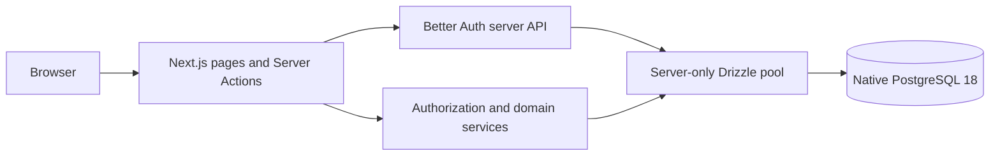

# System architecture

The application is a Next.js 16 modular monolith running directly on Windows. Server Components render trusted reads, Server Actions perform commands, Better Auth resolves identity, Drizzle provides typed PostgreSQL access, and native PostgreSQL is the authoritative state store.

Client Components receive rendered data and submit forms; they cannot import database modules. `src/lib/database/client.ts` owns a bounded `pg` pool and preserves it during development hot reload. Scripts create short-lived pools and always close them.

Identity is not authorization. Active organization membership, role scope, active/non-expired assignments, location membership, and organization/location ownership are rechecked for every operation. Organization repositories require `userId` and `organizationId`; location operations require `userId`, `organizationId`, and `locationId`. UI gates are presentation only.

The Next.js Proxy checks only whether a session cookie exists and redirects obviously unauthenticated requests. Server layouts and actions resolve the current Better Auth session from request headers and deny stale, suspended, archived, or out-of-scope access.

The implemented domains are `auth`, `access`, `onboarding`, `admin`, and `inventory`. Inventory includes catalog, ledger, donors, receiving, adjustments, condition controls, cycle counts, and transfers. Household, appointment, reservation, SMS, forecasting, reporting, and assistant domains remain out of scope and must follow the same trusted server boundary and explicit scope design.

Prompt 4 inventory writes are orchestrated by `src/domains/inventory/operations-service.ts`. Browser actions validate input and resolve a session, while the service independently verifies organization/location permission inside the database transaction. Ledger writes remain centralized in `ledger.ts`.

Deployment is intentionally provider-neutral. Local development requires only Node.js, pnpm, and native PostgreSQL. Optional future providers must remain server adapters and cannot become hidden local requirements.
