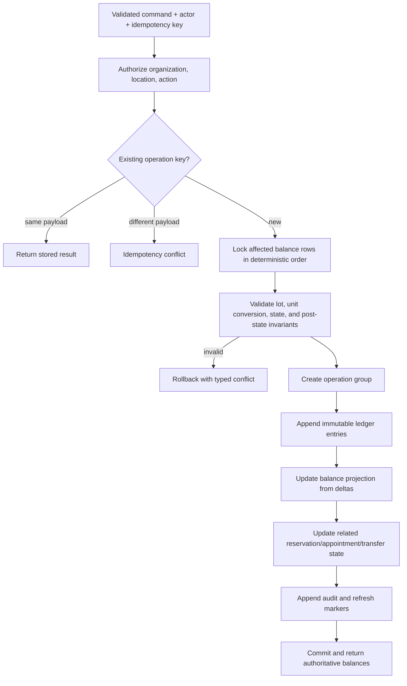

# Inventory Ledger

## Implemented Prompt 4 balance semantics

The current application has no household reservations. For each active, non-expired lot, `valid_on_hand` is physical stock. `available_quantity` equals valid stock only when no active quarantine or recall hold exists; otherwise it is zero. Expired, depleted, and archived lots are unavailable. Transfers are unavailable between dispatch and receipt through the derived `inventory_in_transit_balances` view.

Receiving, approved adjustments, condition removals, cycle-count reconciliation, dispatch, and receipt all append transactions through the same Prompt 3 ledger. Correction uses an exact reversal plus a replacement rather than editing a transaction.

## Accounting principles

Inventory is an append-only, lot-level ledger. A quantity displayed anywhere must be reproducible from `inventory_transactions` plus current lot dates and active reservation state. `inventory_balances` accelerates reads but is not editable and may be rebuilt.

Each item has one base unit. Every ledger delta is stored in that base unit with `numeric(20,6)`. The receipt's original quantity/unit and exact conversion version are retained for explanation. No transaction mixes items, lots, locations, or units.

## Transaction effects

| Transaction type                                                                                | Physical delta | Reserved delta | Quarantined delta | Notes                                                            |
| ----------------------------------------------------------------------------------------------- | -------------: | -------------: | ----------------: | ---------------------------------------------------------------- |
| `donation_received`, `purchase_received`, `opening_balance`, `transfer_in`, positive adjustment |              + |              0 |      optional 0/+ | Creates/increases physical lot stock                             |
| `distribution`                                                                                  |              − |              0 |                 0 | Non-reserved outbound distribution                               |
| `reservation_created`                                                                           |              0 |              + |                 0 | Lot allocation; never physical consumption                       |
| `reservation_released`                                                                          |              0 |              − |                 0 | Cancellation, expiry, substitution, or remainder                 |
| `pickup_fulfilled`                                                                              |              − |              − |                 0 | One entry consumes physical and its reservation together         |
| `spoilage`, `expiration`, `damage`, `recall_disposal`, negative adjustment, `transfer_out`      |              − |              0 |               0/− | Reserved stock must first be released/reallocated                |
| `quarantine_placed`                                                                             |              0 |              0 |                 + | Blocks otherwise valid physical stock                            |
| `quarantine_released`                                                                           |              0 |              0 |                 − | Requires review outcome                                          |
| reversal/correction                                                                             | Exact negation | Exact negation |    Exact negation | References original entry/group; corrected operation is separate |

Transfers have linked operation groups. `transfer_out` removes source physical stock at dispatch; it is then in transit and unavailable. `transfer_in` adds destination stock only on receipt. A transfer never uses a single row spanning two locations.

## Exact balance definitions

For one lot at an `as_of` instant:

```text
physical_on_hand = SUM(physical_delta_base for committed entries effective <= as_of)
reserved = SUM(reserved_delta_base for committed entries effective <= as_of)
quarantined_nonexpired = SUM(quarantined_delta_base) only while lot is not expired
expired = physical_on_hand when expiration_date < location_local_date(as_of), else 0
distributable_on_hand = physical_on_hand - expired - quarantined_nonexpired
available = distributable_on_hand - reserved
```

Expired and quarantined buckets are intentionally disjoint: once a lot is expired, its remaining physical stock is reported as expired, not also quarantined. This makes the requested aggregate formula exact and avoids double subtraction:

```text
available = on_hand - active_reservations - quarantined_quantity - expired_quantity
```

`on_hand` means all physical stock still present, including blocked or expired stock. `reserved` may exist only on nonexpired, nonquarantined stock. `expired` is date-derived until confirmed physical removal posts an `expiration` negative entry. An expiry alert never changes the ledger.

`expected_incoming` is the unreceived base quantity of confirmed donation/shipment lines due to the location. It is not a ledger balance and is never available. `projected` is a forecast value, not stock:

```text
projected_available(horizon) =
  available_now
  + confirmed_incoming_due_by_horizon
  - unreserved_expected_demand
  - currently_available_quantity_expiring_before_use
```

Forecast demand reconciliation is defined in `06-forecasting-design.md` so reservations and appointments are not double-counted.

## Invariants

1. `physical_on_hand`, `reserved`, `quarantined`, and `available` cannot be negative after any commit.
2. `reserved + quarantined_nonexpired <= physical_on_hand` for a nonexpired lot; reservations and quarantine cannot overlap the same units.
3. Expired or quarantined lots cannot receive a new reservation or outbound distribution.
4. A reservation cannot exceed current available stock unless a manager uses an explicit, reasoned override that creates a conflict state—not negative available stock.
5. Pickup fulfillment reduces physical and reserved quantities by the same fulfilled amount in one transaction; unused reservation is explicitly released or retained by policy.
6. Cancellation/no-show releases active reservation exactly once.
7. Every adjustment, override, disposal, and reversal has a reason, actor, request ID, and audit event.
8. High-impact adjustment thresholds are checked in base units and/or value; workers create proposals above threshold.
9. Transactions are immutable. Database privileges deny update/delete.
10. External retries and repeated forms return the original result for the same key and payload; a different payload with that key is a conflict.

## Inventory transaction flow



## Reservations and FEFO

Reservation requests specify item/category demand in base units. Allocation selects eligible lots at the appointment location ordered by:

1. known expiration date ascending;
2. unknown expiration last (and alert if the item normally requires expiry);
3. received date ascending;
4. lot UUID for deterministic tie-breaking.

The database locks candidate `inventory_balances` rows in that order, recalculates available quantity under lock, and may split one requested line across lots. All lines commit together unless the caller explicitly selected an allowed partial-reservation workflow. Dietary and package substitutions are allocation decisions before FEFO; FEFO never substitutes a different item.

Reservations have explicit `active`, `partially_fulfilled`, `fulfilled`, `released`, `expired`, or `conflict` state. Scheduled cleanup uses the same transition function as users. It cannot post a second release because both version and active-state checks are atomic.

## Receiving flow

Completion uses one transaction: claim idempotency key; create donation and received lines; create a lot per distinct item/expiry/lot/storage/condition; append positive receipt entries; update projections; audit; add forecast/alert markers. If any line fails, nothing is received. Photos and receipts, if added later, use post-commit background processing and do not determine inventory success.

## Corrections and reversals

- A reversal operation references an original committed operation group and posts exact inverse entries to the same lots.
- A unique constraint prevents reversing the same original entry twice unless a reversal itself is being reversed through an explicit new chain.
- Before reversal, the function simulates post-state. If subsequent transactions make an inverse invalid (for example stock was already distributed), the command returns a conflict and requires a manager-designed correcting set rather than corrupting history.
- Appointment completion correction reverses fulfillment/status through a dedicated workflow, then optionally posts the corrected quantities. Audit shows both operations.
- A data-display edit such as a nonsubstantive lot note may update the lot with before/after audit; quantity, unit conversion used, item, and receipt facts require ledger correction/new lot.

## Concurrency and idempotency

- Use `READ COMMITTED` with explicit `SELECT ... FOR UPDATE` on affected balance/reservation/appointment rows; retry serialization/deadlock failures only at the trusted server boundary.
- Lock multiple rows in stable `(location_id, item_id, expiration_date NULLS LAST, lot_id)` order.
- The client creates a UUID idempotency key when a form becomes submittable and reuses it for retries.
- `operation_requests` stores operation, actor/org, request hash, result reference, and final state. Provider/webhook IDs have separate unique constraints.
- Database functions, not application read-then-write sequences, decide whether stock exists.

## Unit handling and rounding

- Unit dimensions prevent nonsensical conversions. Cross-dimension conversion is prohibited.
- Count conversions normally require an integer factor; mass/volume may use exact decimals.
- `base_quantity = input_quantity × versioned_factor`. Validate that the result fits the item's base precision.
- Rounding occurs once at command validation using the conversion's declared `reject`, `floor`, `ceiling`, or `half_up` policy. Inventory-affecting conversions default to `reject` when exact representation is impossible.
- Historical entries retain input quantity/unit, factor, conversion ID/version, rounding delta, and base result. Updating a case size creates a new effective conversion and never changes history.
- No general case-to-can, pound-to-box, or kit-to-item rule exists. Every conversion is item-specific.

## Expiration, quarantine, and recall

Expiration uses the pantry location's local date. A job opens alerts and the read model excludes expired stock at midnight local time even before staff confirms physical removal. Quarantine is ledger state with a reason and review owner. Recall matching may propose quarantines for affected lots, but a person confirms unless a verified policy explicitly authorizes a safety hold; disposal always requires confirmation.

## Stock reconciliation and historical reporting

Cycle counts compare counted physical quantity with the ledger projection. A variance does not edit `inventory_balances`; an approved positive/negative adjustment posts the difference. Reports accept an `as_of` instant and replay/sum entries effective by then. Reversal entries remain visible and net correctly. Current expiration classification is not retroactively applied to historical dates: the report compares expiration date with the requested historical location date.

## Edge cases

- Missing expiration: eligible only when item policy permits; FEFO last and alert generated.
- Lot expires while reserved: conflict alert; reservation cannot be fulfilled until manager reallocates or documents an exceptional policy.
- Recall after reservation: quarantine placement requires atomic release/reallocation or creates a blocked conflict; never silently fulfill.
- Duplicate barcode/lot: warn using organization/item/source/lot/date similarity; idempotency prevents exact duplicate commit.
- Backdated transaction: manager-only after closed-period policy check; projection and forecasts refresh from effective date.
- Opening balance: allowed only during controlled onboarding/reconciliation with reason and no earlier item/location ledger unless elevated override.
- Zero usage or no stock: exact zero is valid; division and forecast confidence handling are explicit, not exceptions.
