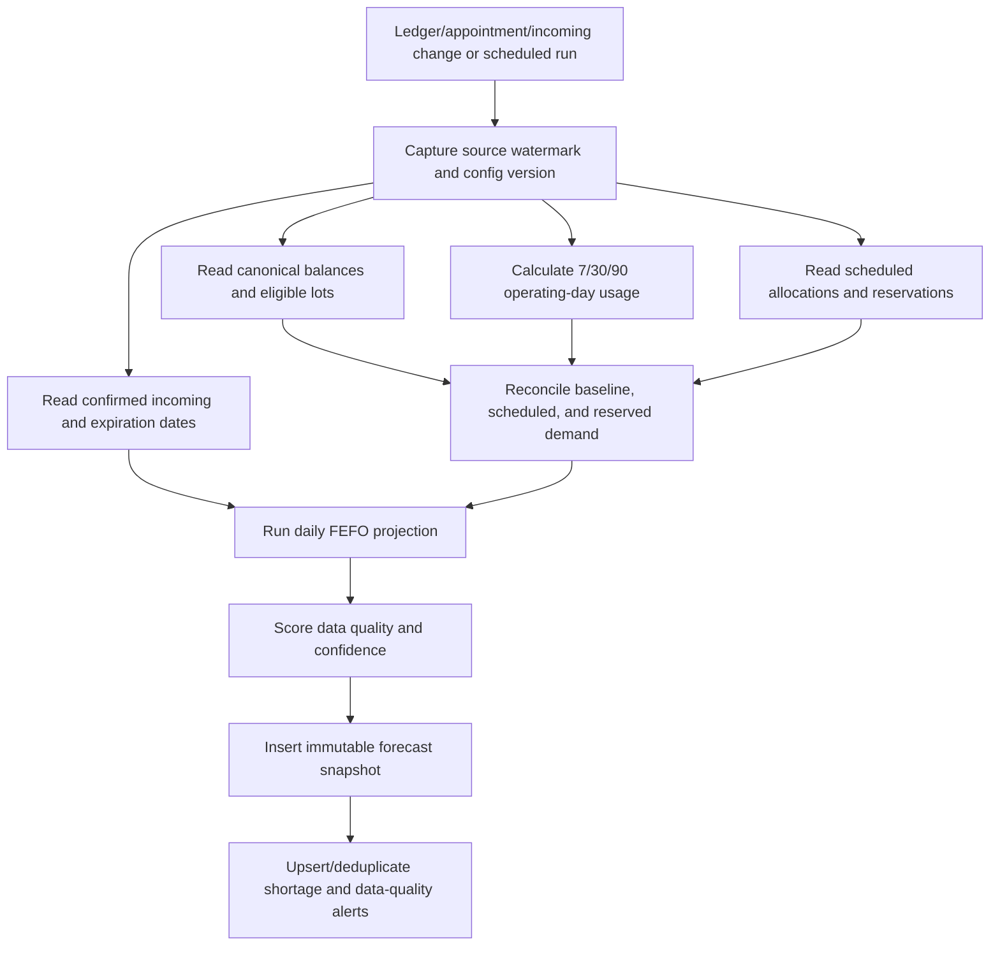

# Forecasting Design

## Goals and boundaries

Version-one forecasting is deterministic, explainable, and reproducible from ledger and appointment data. It prioritizes operational warnings over statistical sophistication. It does not purchase food, promise future supply, reinterpret missing data, or use an LLM to set confidence.

Every snapshot is immutable and records algorithm/config version, source watermark, location timezone/calendar, inputs, result, confidence score/label, warnings, and override reasons.

## Inputs

- Net physical outbound usage from `distribution` and `pickup_fulfilled`, including reversals, in the item base unit
- Current on-hand, reserved, quarantined, expired, and available balances
- Scheduled appointment allocations and their active reservations
- Confirmed incoming donation/shipment lines with expected date; unconfirmed pledges are shown but excluded
- Lot expiration dates and the quantity likely to expire before use
- Location operating days and closures
- Item/category safety stock and replenishment lead time
- Manager forecast overrides with effective dates, reason, actor, and audit
- Data-quality signals: history length, missing expiry/conversions, adjustments, anomalies, and allocation coverage

Transfers are neither demand nor incoming organization supply. For a location, a dispatched transfer-out is already absent from stock; a confirmed inbound transfer may be shown as incoming only after dispatch, never as available.

## Usage calculation

For lookback window `w`:

```text
average_daily_usage_w =
  net_outbound_base_quantity_during_w / operating_days_during_w
```

Only days the pantry is configured open count in the denominator. If operations occur on a closed day, the transaction counts and the day is added to the actual-active-day denominator. Reservations, transfer movement, receipts, spoilage, expiry, quarantine, and manual adjustments are not demand.

Default proposed weights are configurable per organization/category and must sum to 1:

```text
weighted_daily_usage =
  0.50 × avg_7_operating_days
  + 0.30 × avg_30_operating_days
  + 0.20 × avg_90_operating_days
```

If a window lacks its required history, weights are renormalized across usable windows and confidence is reduced. If there are no outbound observations, usage is `0` as an observed result but the forecast is `insufficient_data`, not “unlimited days of supply.”

Manager overrides may multiply daily usage, set a temporary fixed daily usage, or change safety stock. They never overwrite history and are always displayed.

## Scheduled demand without double counting

For horizon `H`:

```text
baseline_demand_H = weighted_daily_usage × future_operating_days_H
scheduled_demand_H = sum(active appointment allocations due in H)
expected_total_demand_H = max(baseline_demand_H, scheduled_demand_H)
reserved_for_H = active reservation quantity linked to those appointments
unreserved_expected_demand_H = max(0, expected_total_demand_H - reserved_for_H)
```

The `max` treats scheduled pickups as known demand within the historical baseline, rather than adding them on top. If scheduled appointments exceed baseline, the excess becomes visible. Because current `available` already subtracts all active reservations, only `unreserved_expected_demand` is subtracted again.

An optional later configuration may model known appointments as a fraction of total demand, but it must be a versioned explicit formula—not an AI estimate.

## Expiration-aware projection

Daily simulation is preferred to a single algebraic horizon because incoming, appointments, expirations, and operating days occur on dates:

1. Start with each lot's current distributable on-hand less active reservations.
2. On each local date, expire lots before distribution according to the organization's chosen end-of-day/use-by policy; version one defaults to unavailable when `expiration_date < current local date`.
3. Add only confirmed incoming quantities due that date to a projected supply bucket, not actual on-hand.
4. Apply reserved appointment consumption to its lots; apply remaining expected demand using FEFO.
5. Compare closing projected available with safety stock and lead-time demand.

`expiring_before_use` is the quantity the simulation cannot allocate before its expiration. It is reported separately and excluded once expired; it is not subtracted twice.

## Days of supply and shortage logic

```text
days_of_supply = available / weighted_daily_usage
reorder_point = safety_stock + (weighted_daily_usage × lead_time_operating_days)
```

- If daily usage is zero and data is adequate, days of supply is displayed as `not currently consuming`, not infinity.
- If usage data is inadequate, days of supply is `not available`.
- A projected shortage date is the first simulated operating date on which projected closing available is below zero or cannot meet known scheduled demand.
- A low-stock condition occurs when current available is at or below configured minimum.
- A projected-shortage alert occurs when stock crosses zero within the configured horizon.
- An urgent shortage occurs before the next feasible replenishment date or affects confirmed appointments.
- A reorder warning occurs when projected stock falls below `reorder_point`, even if it does not reach zero in the horizon.

Every warning displays current on-hand, reserved, available, scheduled demand, expected daily usage, confirmed incoming, expiring-before-use, safety stock/lead time, shortage date, confidence, primary drivers, and recommended human action.

## Confidence method

Confidence is a transparent 0–100 data-quality score, not a probability of the forecast being correct.

| Component                       | Points | Rule examples                                                              |
| ------------------------------- | -----: | -------------------------------------------------------------------------- |
| Usable history                  |   0–30 | 90+ operating days=30; 30–89=20; 7–29=10; fewer=0                          |
| Ledger/unit integrity           |   0–20 | Valid conversions and no unresolved reconciliation=20; deductions for gaps |
| Appointment allocation coverage |   0–15 | Percent of upcoming active appointments with quantified allocations        |
| Demand stability                |   0–15 | Lower robust coefficient of variation scores higher; spikes are flagged    |
| Expiration completeness         |   0–10 | Required lots with valid expiry dates                                      |
| Adjustment/anomaly burden       |   0–10 | Low unexplained adjustment share and no unresolved anomaly scores higher   |

Labels: `high` 80–100, `medium` 60–79, `low` 35–59, `insufficient_data` below 35. Missing base unit/conversion, no usable history plus no scheduled allocation, or an unresolved negative/reconciliation invariant forces `insufficient_data` regardless of numeric score.

Confirmed incoming affects projection, not confidence by itself. Dependence on a large proportion of future incoming is shown as a risk reason; unconfirmed incoming is excluded and shown as context.

## Category forecasting

Heterogeneous cans, pounds, and boxes cannot be summed. Each forecastable broad category defines a `category_equivalent_unit` (for example, one protein allocation credit). Each participating item has an explicit, versioned `item_category_equivalent` factor from its base unit to that category unit. Missing factors are never guessed.

```text
category_available = SUM(item_available_base × item_category_factor)
category_demand = category allocation credits from appointments and historical fulfilled packages
```

An item has one primary leaf forecast category for a snapshot, so it contributes once. Parent categories roll up disjoint child categories using their configured equivalent mapping. Items without a valid factor appear in an “unmapped stock” warning and are excluded from the numeric category total. Category confidence is capped by mapping coverage and the weighted confidence of contributing items.

This category view supports substitutable coverage planning; item forecasts remain authoritative for exact lot fulfillment.

## Forecast generation flow



Jobs use `(scope, source_watermark, algorithm_version)` uniqueness. If source data changes during calculation, the result is stored with its captured watermark and a new run is queued.

## Limitations

- Sparse or changing demand produces low confidence.
- The model cannot anticipate emergencies, policy changes, or donor behavior without explicit overrides.
- Historical distributions reflect constrained supply; low usage may mean stockouts, not low need. Periods with stockout alerts are flagged and may be excluded by a versioned rule.
- Category equivalents are operational planning units, not nutritional claims.
- Expected arrival dates are only as reliable as staff confirmation; no unconfirmed quantity is counted.
- Seasonality, event calendars, causal modeling, and machine learning are future capabilities.

## Test scenarios

1. Stable 90-day usage with no appointments reproduces the weighted formula and high confidence.
2. Ten reserved appointment units are already absent from available and are not subtracted twice.
3. Scheduled demand above baseline contributes only the excess beyond reservations.
4. Confirmed incoming after the shortage date does not hide the earlier shortage.
5. Unconfirmed incoming never changes projected stock.
6. A lot expiring before demand is excluded on the correct local date and counted once.
7. Zero usage returns no numeric days-of-supply infinity.
8. Reversal removes the original distribution's demand effect.
9. Manual negative adjustment changes stock but not usage and lowers confidence when material.
10. Category items with valid equivalents roll up once; unmapped items generate a warning.
11. A pantry closure changes future operating days and reminder/appointment demand consistently.
12. Re-running the same watermark/version produces one snapshot and identical results.
