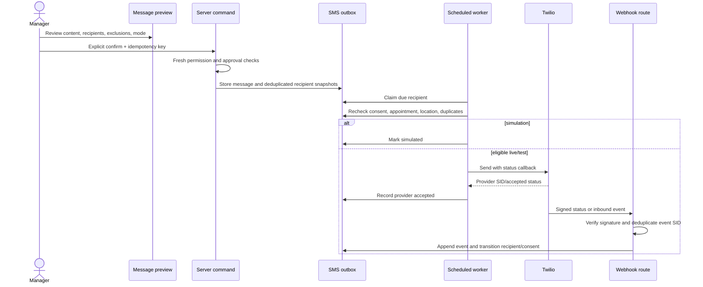

# SMS Design

## Architecture

Twilio is the first provider behind a server-only `SmsProvider` interface. Internal message, recipient, consent, and event records are authoritative for application workflow; Twilio is authoritative only for provider acceptance/delivery events. The integration is optional: simulation mode exercises all eligibility and state transitions without external sends.

```ts
interface SmsProvider {
  send(input: {
    to: string;
    body: string;
    statusCallbackUrl: string;
    idempotencyRef: string;
  }): Promise<{
    providerMessageId: string;
    acceptedStatus: string;
  }>;
  validateWebhook(input: {
    url: string;
    params: Record<string, string>;
    signature: string;
  }): boolean;
}
```

This is a boundary sketch, not implementation. Provider-specific statuses are mapped to stable internal states.

## Consent and phone handling

- Normalize valid phone numbers to E.164 on the server using a maintained library; retain raw entry only as restricted audit context when necessary.
- A send-eligible consent record requires household, exact normalized phone, `sms` channel, granted status, timestamp, source, evidence, and language.
- Every grant, revoke, STOP, START, import, staff correction, and phone change appends `sms_consent_events`; current state is a projection on `sms_consents`.
- Consent does not transfer automatically to a changed phone number. A new phone requires new evidence.
- STOP is processed immediately and globally for that organization/phone before any other inbound automation. Pending recipients are cancelled/excluded.
- START re-enables only when provider rules and pantry policy recognize it as valid renewed consent; the event is retained.
- HELP returns the configured assistance response without changing consent.
- Staff cannot override an opt-out to send. They may correct a verified data error through an audited consent workflow.

Consent collection language, retention, quiet hours, and messaging rules require later legal/policy review for the operating country. Architecture enforces recorded evidence and opt-out regardless.

## Templates and drafting

Templates are versioned by purpose and language and use an allowlist of variables such as household display name, appointment date/window, pantry name, location, and contact instructions. Rendering rejects missing/unknown variables and stores the approved template version plus rendered hash.

Drafting creates content and a recipient query snapshot but sends nothing. A draft may be AI-assisted, but a user owns and reviews it. The preview calculates GSM/UCS-2 segment estimate, language variants, recipient counts, exclusion categories, duplicates, quiet-hour impact, and scheduled time.

Do not include sensitive household composition, dietary restrictions, or internal notes in SMS. Templates should identify the minimum appointment information and avoid revealing pantry participation if policy requires discreet wording.

## Scheduling and approval

Scheduling creates `sms_message` and `sms_recipient` outbox rows. It is cancellable until a recipient is claimed for send. Appointment reminder rows are created from appointment/template/location policy and updated on reschedule/cancellation.

Manual one-to-one and all bulk sends require a confirmation screen showing:

- recipient and excluded counts with reasons;
- exact content and language variants;
- estimated segments;
- planned time and timezone;
- consent and duplicate summary;
- location/filter scope;
- simulation/test/live mode;
- approver requirement and irreversible-side-effect warning.

Inventory workers may draft if granted `sms.draft`; managers/admins with `sms.send` confirm. Bulk messages additionally require `sms.bulk.approve`. The confirmer cannot rely on an earlier permission snapshot; authorization and recipient eligibility are recalculated immediately before scheduling and again before sending.

## Recipient eligibility and deduplication

At send time, a recipient is excluded if consent is missing/revoked, phone is invalid, appointment is cancelled/rescheduled/outside relevant state, household is inactive, location/filter no longer matches, quiet-hour policy defers it, or the same phone already appears in the message.

Deduplication key is `(message_id, normalized_phone_hash)`. For multiple households sharing a phone, one bulk announcement is sent and the recipient record notes the collapsed targets. Appointment-specific messages are not combined when content differs; the preview flags potential confusion.

## Sending and retry states

Internal recipient states: `draft`, `excluded`, `scheduled`, `claimed`, `provider_accepted`, `sent`, `delivered`, `failed_retryable`, `failed_terminal`, `cancelled`, and `simulated`.

The worker claims due recipients with a lease and `SKIP LOCKED`, rechecks eligibility, then calls Twilio. Provider acceptance stores the Twilio message SID under a unique constraint. Network timeout after an uncertain send is reconciled by idempotency reference/provider lookup before retry. Retry only transient network, rate-limit, and provider 5xx failures with capped exponential backoff and jitter. Invalid number, blocked destination, consent failure, and permanent provider errors are terminal. Attempt limit and time window are configurable; terminal failures create an alert when operationally important.

Twilio may not offer native idempotency semantics for every send path, so the application prevents duplicate worker claims, stores a stable internal reference, and reconciles uncertain attempts before initiating another external request.

## Scheduling and delivery flow



## Webhooks and incoming replies

Use a public Next.js Route Handler with the exact externally configured HTTPS URL. Before processing:

1. preserve raw form parameters required by Twilio validation;
2. validate `X-Twilio-Signature` against the configured auth token and exact URL;
3. reject invalid signatures without exposing detail;
4. insert `external_webhook_events` by unique provider event/message/event-type identity;
5. acknowledge duplicate valid delivery quickly;
6. enqueue or perform bounded processing.

Handle queued/sent/delivered/failed/undelivered, incoming STOP/START/HELP, and explicit confirmation replies. Free-form replies are stored minimally and routed to staff; they are not passed to AI automatically. Out-of-order delivery statuses use a monotonic state precedence plus raw event history, so a late “sent” event cannot replace “delivered.”

## Test and simulation modes

- **Simulation:** no provider call; uses clearly fictional `+1 202-555-01xx` numbers, produces recipient/event records marked simulated, and exercises exclusions.
- **Twilio test credentials:** validates adapter behavior using Twilio's documented test destinations; records mode and never mixes with production analytics.
- **Production:** enabled only by explicit environment flag, production credentials, verified sender, configured webhook, and deployment checklist.

The UI displays a persistent environment/mode badge. Seed data can never be promoted to live send eligibility.

## Security and privacy

- Credentials and webhook auth tokens are server-only and rotated through provider/deployment secret stores.
- Restrict message/consent base tables; inventory workers and volunteers do not read phone lists or message bodies.
- Logs use recipient/message IDs and phone hash, not full number/body. Audit before/after values are redacted.
- Rate-limit draft previews, confirmations, and inbound endpoints; cap bulk audience and require second approval above policy threshold.
- Apply Content Security Policy and output escaping to message previews; templates do not execute code.
- Exports of consent/message history are admin-only, purpose-limited, expiring, and audited.
- Retention removes/redacts bodies and inbound free text according to policy while retaining minimum delivery/consent evidence.

## Operational failure behavior

- Twilio unavailable: core pantry workflows continue; messages remain scheduled/retryable and an alert is shown.
- Partial bulk acceptance: each recipient has an independent state; summary shows exact accepted, excluded, retrying, and terminal counts.
- Appointment changes after scheduling: pending recipient is cancelled and a new reminder is generated from the new appointment/version.
- Consent revoked after provider acceptance: pending sends cancel; already accepted provider side effects cannot be recalled, and the timing is auditable.
- Webhook backlog: provider events remain idempotent and reconciliation compares internal provider SIDs/statuses later.
