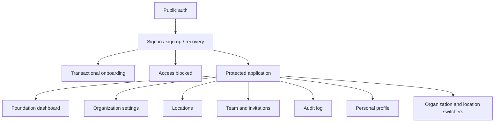

# UX and Information Architecture

## Phase 1 direction

The interface uses a restrained civic-information style: neutral paper-like surfaces, Swiss red as the sole action accent, compact typography, one-pixel rules, and explicit status text. It is designed to feel trustworthy on shared pantry workstations rather than promotional.

The distinctive navigation element is a numbered scope rail:

1. signed-in person;
2. active organization;
3. active pantry location;
4. effective permissions.

This keeps the authorization context visible before future operational actions are added.

## Information architecture

Navigation items are omitted when their required permission is absent. Hiding navigation is a usability measure only; server and database authorization remain authoritative.

## Responsive behavior

Desktop uses a persistent rail and content canvas. Mobile collapses navigation into a compact header while preserving organization and location controls. Forms use explicit labels, visible validation, keyboard-operable controls, and text-plus-color statuses. Empty states state why no data is shown and what permitted action is available.

## Content rules

The product displays persisted account, organization, and inventory data only. Invitations are described as prepared links because delivery is not implemented. Inventory pages show derived ledger balances, real receiving/approval states, and explicit in-transit or held quantities. Destructive and approval actions name the object and are guarded by both UI permission checks and transactional database rules.

The inventory operations navigation exposes receiving, donors, adjustments, condition controls, counts, transfers, activity, catalog, and storage. Detail routes keep line-level context visible during receiving, counting, and transfer work on desktop and mobile.
