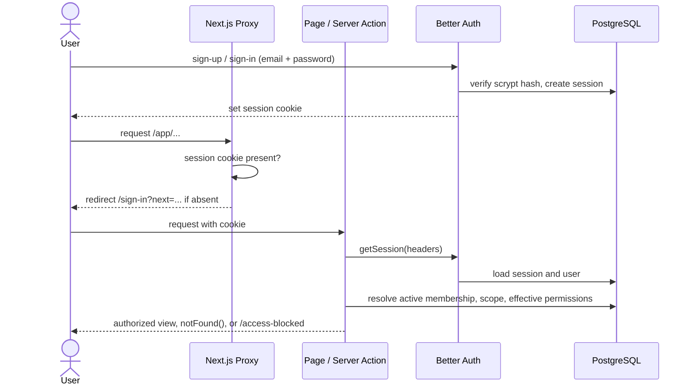
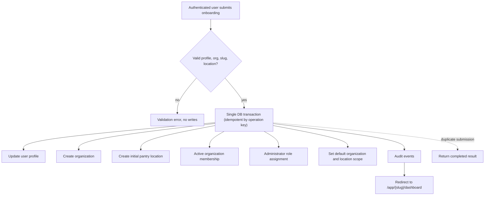
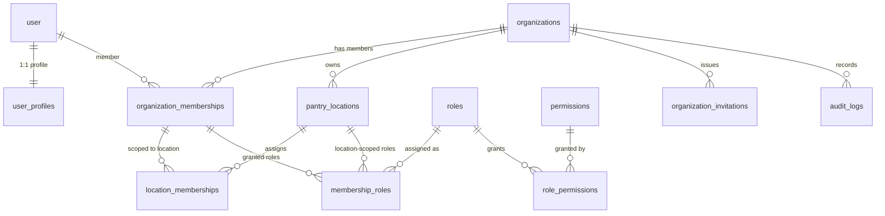
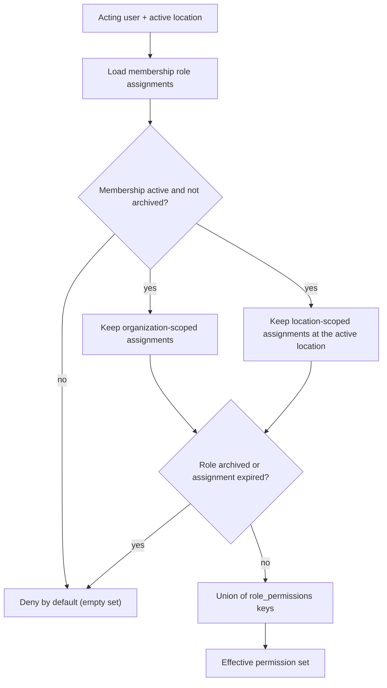
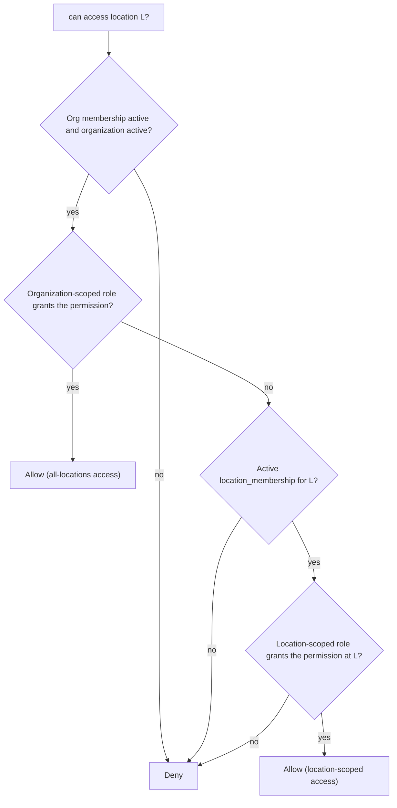
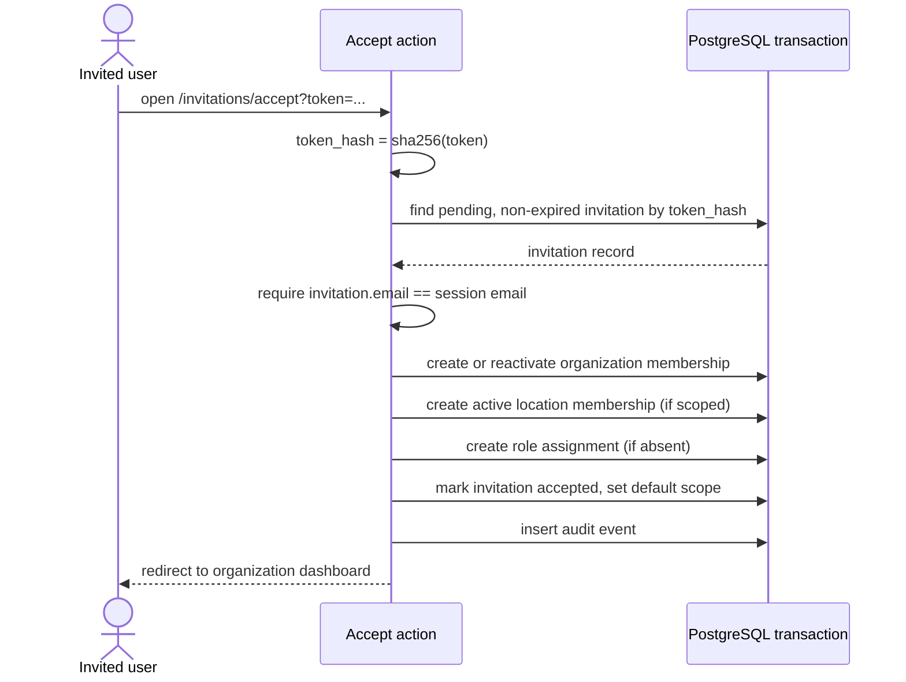
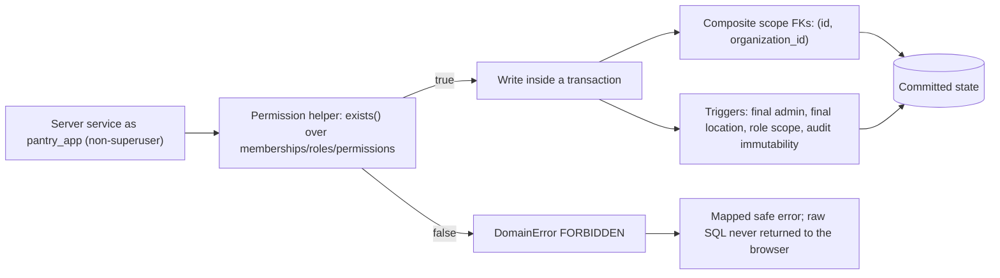
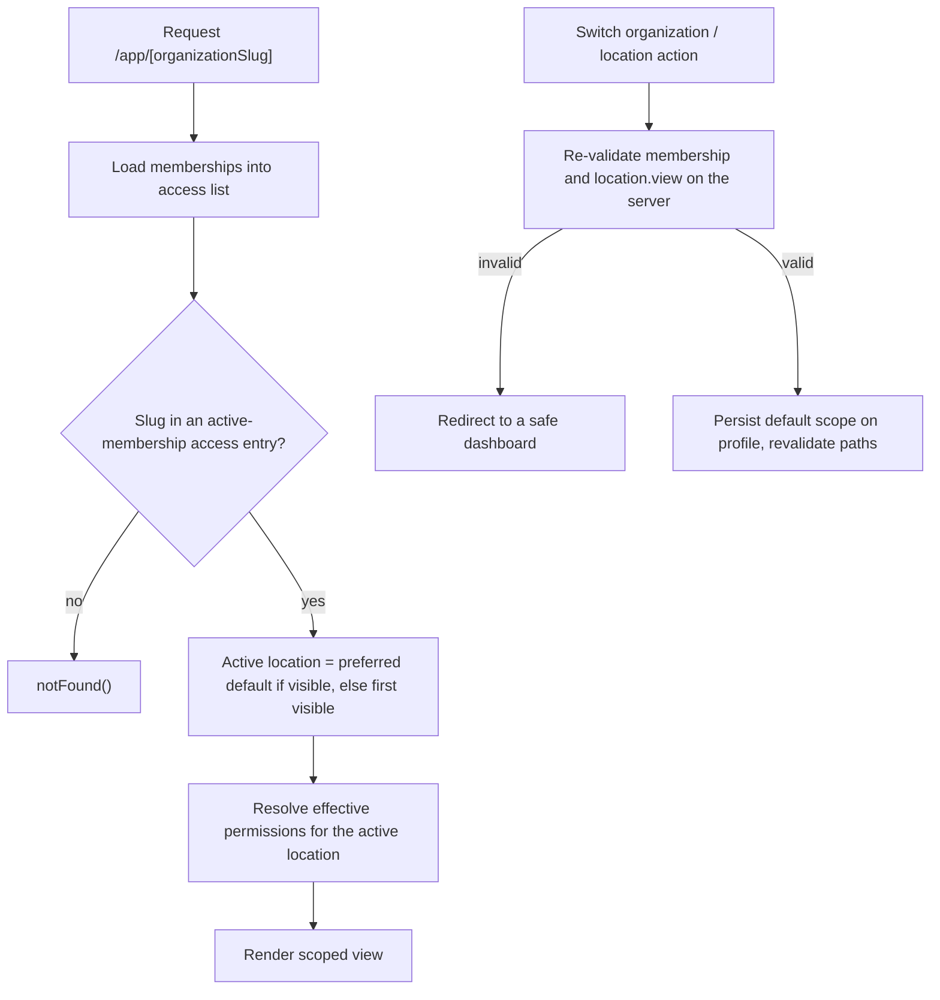

# Authentication, organizations, and permissions

Better Auth provides sign-up, sign-in, sign-out, credential hashing, verification/reset records, and secure sessions in native PostgreSQL. A database trigger creates the matching profile. Password reset links are stored in the server-only development message table until a production email adapter is configured.

Onboarding validates profile, organization, slug, locale/timezone, and initial location data, then runs one transaction: profile update, organization and location creation, active organization/location memberships, administrator assignment, default scope, operation idempotency, and audit events. Duplicate submissions are rejected or return the completed result.

Users may belong to multiple organizations. Organization roles grant only organization-scoped permissions; location roles grant permissions only at an actively assigned location. Effective permissions exclude expired/archived assignments. Active organization and location preferences are stored on the profile but are validated again whenever changed.

Protected pages resolve the session and organization context on the server. Queries accept the acting user and scope. Server Actions validate inputs and perform a preliminary permission check; transactional services repeat it and enforce record ownership before writing. Database constraints provide the final cross-scope boundary.

Administrator, manager, inventory worker, volunteer, and read-only role matrices are seeded. Suspended users may retain an identity session but receive the access-blocked state and cannot perform protected database operations. The final administrator cannot be removed, suspended, archived, or stripped of the last administrator role.

Invitations store only a SHA-256 token hash, expire after seven days, require an email match, and atomically create/reactivate the correct membership, location assignment, role assignment, profile scope, and audit event.

## Diagrams

These diagrams describe the implemented native PostgreSQL and Better Auth foundation. They replace the earlier Supabase `auth.uid()` and Row Level Security design; the equivalent boundary is now the server-only `pantry_app` role plus relational constraints and triggers (see `docs/17-native-windows-postgresql-migration.md`).

### Authentication and protected-route flow

### Organization onboarding transaction

### Membership and role relationships

### Permission resolution

### Location authorization

### Invitation acceptance

### Database authorization enforcement (RLS-equivalent boundary)

### Active organization and location selection

