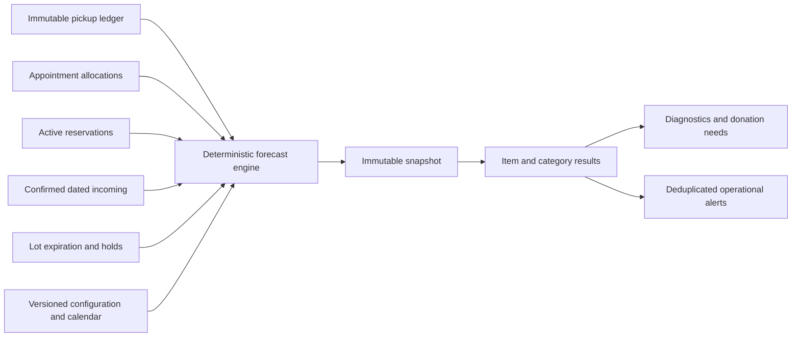

# Forecasting, alerts, and dashboard implementation

Prompt 6 adds deterministic, explainable forecasting to the native Windows PostgreSQL application. No Docker, Supabase, external model, SMS provider, or hosted service participates in calculation.

## Forecast data flow

Historical demand is net posted `pickup_fulfillment` quantity, including reversal effects. Damage, spoilage, adjustments, transfers, reservations, cancelled appointments, and no-shows are excluded. Scheduled allocation demand is split into already-reserved and unreserved quantities; only the latter is subtracted again because active reservations already reduce available supply.

Available inventory comes from the canonical lot-balance view. Confirmed incoming includes dated donations in receiving and remaining dispatched transfers at their destination. Draft donations and unapproved transfers are excluded. Expiration risk is calculated from usable lot balances inside the snapshot horizon.

Weighted demand uses configurable 7-, 30-, and 90-day operating-day averages. Missing windows are renormalized, never invented. Safety stock is the greater of fixed stock and configured demand days. Lead-time demand, days of supply, shortage date, stockout date, and replenishment quantity are deterministic. The confidence score is a data-quality score, not a probability.

## Category service units

Category forecasts never directly add incompatible base units. `category_item_equivalencies` defines the positive quantity of each item that equals one organization-specific service unit. Unmapped items are excluded from the numeric total and create a diagnostic; no conversion is guessed.

## Snapshots, jobs, and failure recovery

Each run takes a source watermark and configuration copy, then inserts immutable item results, category results, diagnostics, and donation-needs recommendations in one transaction. PostgreSQL advisory locking prevents concurrent calculation for the same organization/location. Active job deduplication prevents repeated queue entries. Failed jobs are retained and never erase a previous successful snapshot. `pnpm forecast:run-jobs` processes queued work and can be called by Windows Task Scheduler.

## Alerts and lifecycle

Forecast risk and expiration conditions create deterministic SHA-256 fingerprints. Repeated detection increments one alert. Resolved conditions reopen when detected again; a dismissed warning stays dismissed unless it escalates to critical. Acknowledgement, resolution, dismissal, and reopening create append-only events and audit records. Alerts never mutate inventory or appointments.

## Authorization and privacy

Server services enforce effective location permissions for recalculation, configuration, and alert changes. Queries require the authenticated organization/location context. Suspended memberships fail the shared authorization query. Forecast payloads contain item, category, inventory, and operational values—not household names, contacts, consent data, or sensitive notes. The architecture uses trusted server-only PostgreSQL access rather than Supabase RLS.

## UI and local workflow

Routes include `/forecast`, `/forecast/items/[itemId]`, `/forecast/expiration`, `/forecast/donation-needs`, `/forecast/settings`, and `/alerts`. Run `pnpm db:migrate`, `pnpm db:seed`, and `pnpm dev`; a manager can then create the first snapshot from Forecast. Validation uses `pnpm test`, `pnpm test:db`, `pnpm test:jobs`, `pnpm test:e2e`, and `pnpm build`.

## Known limitations

Windows Task Scheduler registration is not automatic. Purchase shipments currently lack item-line quantities in the existing schema, so only donations with explicit lines and dispatched transfers are eligible incoming sources. Forecast expiration projection is conservative within the horizon rather than a full day-by-day multi-arrival simulator. Advanced statistical models and autonomous actions remain deferred. SMS, controlled AI assistance, and reports are implemented in later final-phase documents.
